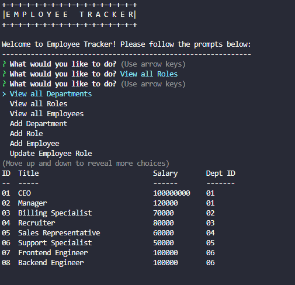

# Employee Tracker
## Description

[Video Walkthrough](https://drive.google.com/file/d/1YSK3QQyO2Fcfa1hFWRRcX_UiPFDclTC_/view)

This is an Employee Tracker designed by Yoon-Jae Kim. The purpose of this app is to allow someone to quickly generate and modify their company's database using Inquirer prompts instead of a MySQL shell/GUI. The purpose of this activity is to solidify SQL concepts as well as provide practice with tying SQL and JS together.

The repo includes schema and seed documents within the '/db' folder to allow for quick testing. Once the db and the tables have been added to the user's local MySQL environment, the app will be ready for use.

When running the server.js file, the app will connect to the company_db database, then prompt the user to select from a list of commands.

The first three options allow the user to view all 3 tables within the company database. These are Departments, Roles, and Employees, respectively.

The next three options allow the user to add a department, role, or employee to their respective tables and will prompt the user to input all necessary fields for them. For role and employee, the app will eventually pull up a dynamic list of departments, roles, and managers, as these ids are tied via foreign primary keys in SQL (e.g. a role's department id is the primary key of the department table).

The last option is to update an employee role. This will also similarly pull up a list of employees, then a list of roles for the user to select, then update.

Methods used here were learned from NW Coding Bootcamp.

## Table of Contents
- [Installation](#installation)
- [Usage](#usage)
- [Credits](#credits)
- [License](#license)
- [How to Contribute](#how-to-contribute)
- [Tests](#tests)

## Installation
Requires node.js and MySQL to be preinstalled.

Clone the repo into your local machine. 

Execute SQL commands from 'schema.sql', then 'seeds.sql' in the '/db' folder.

Install required package modules by running 'npm i' in your CLI. 

Edit lines 14-18 in 'server.js' so that your credentials match your local MySQL connection.

Run 'node server.js' or 'npm start'. 

## Usage
This project can be used by anyone looking to streamline their README creation process.

## Credits
### Github
[Yoonbacca](https://github.com/Yoonbacca)
### Email
[yoonjaekim3@gmail.com](yoonjaekim3@gmail.com)

## License
None

## How to Contribute
This is a solo project and does not require contributions at this time.

## Tests
No test suites have been added to this program
  